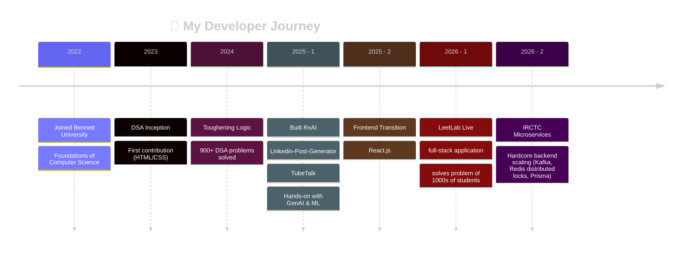

<!-- <div align="center">

<!-- ═══════════════════ HERO BANNER ═══════════════════ -->

<h1 align="center" style="font-size: 56px; margin-bottom: 0px;"><span style="color:#38BDF8;">Uzma Khan</span></h1>

<p align="center" style="margin-top: 5px; margin-bottom: 0px; padding: 0px;">
  <a href="https://github.com/uzmakhan">
    
  </a>
</p>

<!-- ═══════════════════ INTRODUCTION ═══════════════════ -->

## 👨‍💻 Professional Introduction

<table>
<tr>
<td width="62%" valign="top">

I'm a **Software Developer** based in **India** who builds end-to-end web applications — focusing on solid backend architecture.

**What I build:** I design and build full-stack web applications using Node.js, Express, React, and databases like PostgreSQL and MongoDB. My projects go beyond simple CRUD apps—I have hands-on experience setting up microservices that communicate using Kafka, implementing API gateways with rate limiting, handling real-time features using Socket.IO, and managing data concurrency with Redis. Every project I work on is **fully documented, public on GitHub, and deployed live**.

**Architecture & Design Values:**
- **Object-Oriented Architecture:** Write strictly modular backend code by heavily leveraging OOP principles.
- **Design Patterns:** Use patterns like **Singleton** (for shared instances like DB connections or Kafka clients) and follow **Dependency Injection** for loosely coupled, testable components.
- **Layered Separation of Concerns:** Structure code into clear, Class-based Controllers, Service Layers(business logic), and Repository Layers(database abstraction).
- **Execution over Fluff:** Focus on shipping functional, complete applications over half-finished ideas, and believe in learning in public.

**Current focus:** System design, backend architectures, and database optimization.

**Career objective:** A Software Developer **junior role or internship** where I can ship real features, learn from senior engineers, and grow into a product-minded engineer.

</td>
<td width="38%" valign="top">


```yaml
name: Uzma Khan
role: Software Developer - Backend
education: B.Tech CSE specialisation in AI/ML
location: India (IST)
languages: [English, Hindi]
open_to: [Internship, Junior Roles]
remote: Ready ✅
```

</td>
</tr>
</table>


<!-- ═══════════════════ TECH STACK ═══════════════════ -->


##  Tech Stack & Tools


<h3 align="center"> Frontend & Styling</h3>
<div align="center">
  &nbsp;&nbsp;&nbsp;&nbsp;&nbsp;&nbsp;
  &nbsp;&nbsp;&nbsp;&nbsp;&nbsp;&nbsp;
  &nbsp;&nbsp;&nbsp;&nbsp;&nbsp;&nbsp;
  &nbsp;&nbsp;&nbsp;&nbsp;&nbsp;&nbsp;
  &nbsp;&nbsp;&nbsp;&nbsp;&nbsp;&nbsp;
  &nbsp;&nbsp;&nbsp;&nbsp;&nbsp;&nbsp;
  <a href="https://tailwindcss.com/" target="_blank" rel="noreferrer">
    
  </a>
</div>


<h3 align="center"> Backend, APIs & Databases</h3>

<div align="center">
  &nbsp;&nbsp;&nbsp;&nbsp;&nbsp;&nbsp;
  &nbsp;&nbsp;&nbsp;&nbsp;&nbsp;&nbsp;
  &nbsp;&nbsp;&nbsp;&nbsp;&nbsp;&nbsp;
  &nbsp;&nbsp;&nbsp;&nbsp;&nbsp;&nbsp;
  &nbsp;&nbsp;&nbsp;&nbsp;&nbsp;&nbsp;
  &nbsp;&nbsp;&nbsp;&nbsp;&nbsp;&nbsp;
  &nbsp;&nbsp;&nbsp;&nbsp;&nbsp;&nbsp;
  
</div>

<h3 align="center"> Cloud, DevOps & Deployment</h3>
<div align="center">
  &nbsp;&nbsp;&nbsp;&nbsp;&nbsp;&nbsp;
  &nbsp;&nbsp;&nbsp;&nbsp;&nbsp;&nbsp;
  <!-- Fixed Render Box Size to 60x60 -->
  &nbsp;&nbsp;&nbsp;&nbsp;&nbsp;&nbsp;
  &nbsp;&nbsp;&nbsp;&nbsp;&nbsp;&nbsp;
  <!-- Fixed Animated GitHub Box Size to 60x60 -->
  &nbsp;&nbsp;&nbsp;&nbsp;&nbsp;&nbsp;
  
</div>


<h3 align="center"> Workflow, Build & Design Tools</h3>
<div align="center">
  &nbsp;&nbsp;&nbsp;&nbsp;&nbsp;&nbsp;
  &nbsp;&nbsp;&nbsp;&nbsp;&nbsp;&nbsp;
  &nbsp;&nbsp;&nbsp;&nbsp;&nbsp;&nbsp;
  
</div>


<!-- ═══════════════════ FEATURED PROJECTS ═══════════════════ -->

## Featured Projects

<table>
<tr>
<td width="50%" valign="top">

### 🚂 IRCTC — Distributed Microservices Backend
**⚙️ Deep Architecture & Clean Patterns**

[](https://github.com/Uzmaa7/Backend)

> High-concurrency railway booking backend engineered with decoupled microservices and explicit structural design patterns.

**Key Implementations:**
- 📐 **Clean Architecture:** Structured service layers using **Dependency Injection**, class-based controllers, and the **Repository Pattern** for a strict separation of concerns.
- 🏗️ **Distributed Transactions:** Coordinated multi-service data integrity across booking, payment, and inventory flows using Apache Kafka and the **Saga Pattern**.
- 🔒 **Concurrency Controls:** Prevented over-booking and race conditions on concurrent seat selections via **Redis distributed locks**.
- 🛡️ **Resilient API Gateway:** Built a single entry point managing JWT authentication, custom rate-limiting, and fault isolation via **circuit breakers**.
- 📊 **Polyglot Storage:** Isolated service data using a Database-per-Service model across 5 **PostgreSQL** instances via Prisma, coupled with **Elasticsearch** for low-latency station lookups.
- 📉 **Fault Tolerance:** Configured custom Kafka consumers with Dead-Letter Queues (DLQ) to isolate and handle processing failures without stopping the pipeline.

`Node.js` `Express` `Kafka` `Redis` `PostgreSQL` `Prisma` `Elasticsearch` `Docker`

</td>
<td width="50%" valign="top">

### 🧪 LeetLab — DSA Revision Platform
**🎯 Full-Stack Product Engine** · `v1.0` · ✅ Live in Production

[](https://leet-lab-seven.vercel.app)
[](https://github.com/Uzmaa7/LeetLab)

> Full-stack platform solving the "revision gap" faced by 1,000s of students through real-time peer custom coding contests and analytics.
> 
**Key Implementations:**
- ⚡ **Remote Code Execution:** Integrated the **Judge0 API** securely to manage, execute, and score sandboxed user code submissions against dynamic test configurations.
- 🔄 **Real-Time State Sync:** Designed a bidirectional event management layer with **Socket.io** to synchronize live lobby states, ticking contest room timers, and leaderboard updates simultaneously.
- 💬 **TalkTown Chat System:** Engineered a decoupled, persistent communication infrastructure handling private and group message routing for live solution benchmarking.
- 🗄️ **Relational Document Schemas:** Modeled explicit multi-document reference relationships within **MongoDB** to tie profile states, problem lists, custom contests, and live room metrics together.
- 🛡️ **Session Management:** Implemented cookie-based security pipelines handling dual JWT access/refresh token rotation sequences alongside automated image upload flows via Cloudinary.

`React` `Vite` `Node.js` `Express` `MongoDB` `Socket.io` `Judge0` `Tailwind`

</td>
</tr>
</table>

<div align="center">

➕ **The Journey:** Started with basic HTML/CSS/JS in 2025 ➔ Architecting high-concurrency microservices and real-time platforms in 2026. Proof of relentless hard work and execution. 💪

</div>


<!-- ═══════════════════ MY DEVELOPER JOURNEY ═══════════════════ -->



<!-- ═══════════════════ Lets Connect ═══════════════════ -->
## 🤝 Let's Connect

If you're a founder, engineering lead, or recruiter looking for a product-minded engineer who prioritizes clean code, scalability, and system design, let's get in touch!

[](https://www.linkedin.com/in/uzma-khan-8940b825b/)
[](mailto:uz9971khan@gmail.com)
[](https://drive.google.com/file/d/YOUR_DRIVE_FILE_ID/view?usp=sharing)

---
